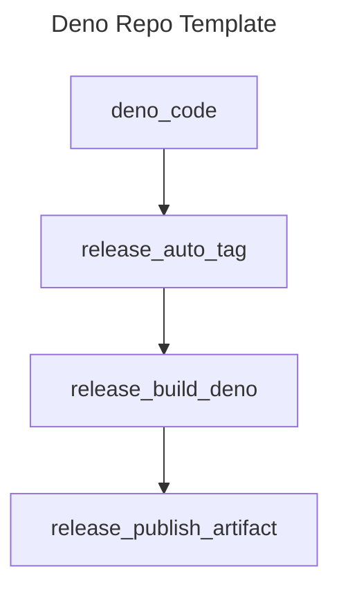

<!-- markdownlint-disable MD041 -->
<!-- markdownlint-disable MD012 -->

# Extensions

This is a reporting & scoring extensions toolkit that comes compiled as a JSR
package for use on our Rules Engine software. The Rules Engine simply runs
pass/fail tests on a variety of dynamic code executions. The code executions
utilize dynamic reporting functions, thus the need for a re-usable package that
provides them.

## Reporting methods

This repo houses extensions for external reporting functions that occur as async
calls through dynamic deno code evaluations. The purpose here is to abstract the
reporting methods into a re-usable package which can be used for any dynamic
code evals.

### What is this?

> [!IMPORTANT]
>
> This is a GENERIC library with no proprietary information inside it. It can be
> re-used for any purpose and is open source.

This is a library for reporting and scoring tools. They can be used for any
purpose as a standard library that gets included. The goal is to provide a
variety of reporting and scoring functions that occur and can be modified
outside the rules engine itself.

## Repo Features

| Feature Name       | Purpose                                                                                             |
| ------------------ | --------------------------------------------------------------------------------------------------- |
| LeftHook           | Github pre-commit and push hooks, this is used in place of Husky because it is 12-factor compliant. |
| Make               | Type 'make' for a list of commands                                                                  |
| Makefile Tasks     | In place of a complete build system, we use a series of scripts listed in 'scripts' dir             |
| Deno Version 2.0.2 | See .dvmrc file                                                                                     |
| Source code        | `src/` directory contains built in auto-versioning                                                  |
| Release Notes      | release-notes.md file                                                                               |
| Trufflehog         | See .hogignore file for configuration                                                               |
| Prettier           | See .prettierignore for config                                                                      |
| Checkov            | Run `make setup-brew` and `make install-tools`                                                      |
| Installation       | Run `make install` to create baseline tags and versions and setup the repo for the first time       |
| Upgrade Templates  | Run `make upgrade` to refresh repository templates automatically                                    |

# Logical Diagram

<!-- github feature -->
<!-- markdownlint-disable MD046 -->

&nbsp;

# LICENSE

MIT License. © Lynsei Asynynivynya 2025.
