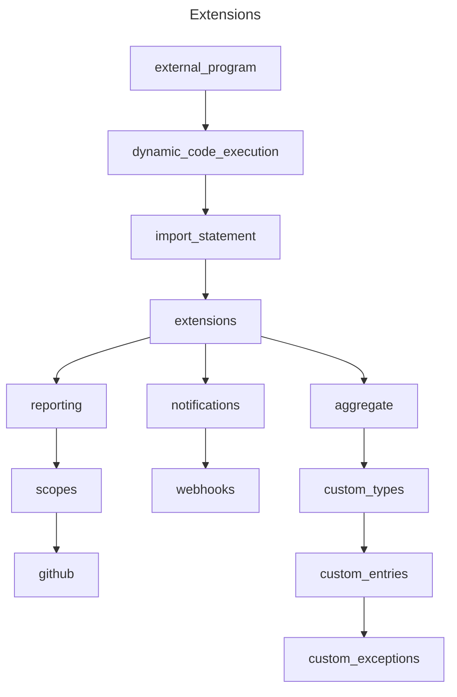

<!-- markdownlint-disable MD041 -->
<!-- markdownlint-disable MD012 -->

# Extensions

[](https://jsr.io/@softdist/extensions)
[](https://github.com/pkgdist/extensions)

`@softdist/extensions` is a generic reporting toolkit that is packaged as a
[JSR](https://jsr.io/@softdist/extensions) module for use on any software that
requires reporting and inspection methods for Github scopes.

## Latest Updates

Please review the
[release notes](https://github.com/pkgdist/extensions/blob/main/release-notes.md)
for information on the latest release.

## What is this?

> [!IMPORTANT]
>
> This @softdist/extensions module is generic and opensource

This is a general library for comparison, github scopes, and reporting. These
tools can be used for virtually any purpose as a standard reporting &
notifications library. The project goal is to provide a variety of reporting
options which can be extended easily for scoring, notifications, or to generate
complex reports based on the inspection of Github Scopes, Azure Scopes, and
other objects.

## Exported Modules

| Feature Name | Purpose                                                                                |
| :----------- | :------------------------------------------------------------------------------------- |
| `$colors`    | Automatic error logging and warn/notice stream logging with colors                     |
| `$const`     | Declared generic constants for local system paths and GITHUB API                       |
| `$compare`   | Comparison functions for deep YML objects.                                             |
| `$error`     | Generic error functions for including messages with specific colors                    |
| `$ruleset`   | Github Rulesets and Rule scopes for detecting branch protections                       |
| `$report`    | Async reporting stream for tabulation of callback data into a simplified report stream |
| `$reporting` | Reporting object and the concept of hooks and custom entry types/ exceptions.          |
| `$streams`   | Optic FileStream object for logging colored error messages to evaluated streams        |
| `$token`     | Token acquisition for GitHub CLI default, or .envcrypt files, or environment vars      |
| `$webhook`   | Webhook secret acquisition IFFE functions                                              |

## Exported Variables

| Variable           | Description                                        |
| :----------------- | :------------------------------------------------- |
| `generatedVersion` | Software Version Information                       |
| `Type`             | Types and Interfaces used throughout this software |

## Github Scopes

We refer to Github Scopes frequently, and by scopes we mean the resources that
RBAC permissions apply to on Github.

#### Examples of Github Scopes

- Workflows
- Repository Settings
- Rulesets
- Actions
- Environments
- Organizations
- Gists

There are many more examples, but you get the idea. Scopes are basically any
major section of the Github API.

## Other Scopes

Currently this software only incorporates Github scopes, however in the future
we will be adding additional scopes such as:

1. Azure
2. AWS
3. JFrog
4. Terraform IAC

One option here is that we will likely be adding a connector for popular
configuration management software such as Ansible in future versions.

## Reporting Features

This repo houses extensions for external reporting functions that occur as async
calls through dynamic deno code evaluations.

The purpose is to abstract the reporting methods into a JSR package which can be
called using `deno run` by passing the `--import-map` flag and referencing a
JSON import map file containing this package.

### Reporting Custom Objects in 0.2.6+

Passing custom objects to the `createReport` function is now trivial.

#### Extending createReportEntry\<custom\>

You can easily use the generic reporting object by instantiating it with a
custom type.

The example below illustrates how custom `Exception` error reporting objects are
passed to the Reporting class:

```typescript
// a custom error exception called Exception:
export type Exception = Error | string | Record<string, unknown>
// a custom HookExample function call to illustrate passing as a hook:
export async function HookExample(entry: string = '') {
  console.log(entry)
}

export const report = await createReport(
  [
    async (entry) => {
      await HookExample( // pass function as hook
        `Test Function`,
      )
    },
  ],
  'report_aggregate.json', // specify report JSON file
)
// add an entry to the 'example_report' with error type <Exception> for <ReportEntryWithErrors> to test_repo
await report.addEntry(
  'example_report',
  createReportEntry<ReportEntryWithErrors<Exception>>({
    repo: 'test_repo',
    score: '3',
    error: { error: 'test error' },
  }),
)
```

### Notifications

Currently the only notification feature is `webhook` fire. This is used
primarily for `MS Teams` integrations. You can use it by setting
`TEAMS_WEB_HOOK` as an environment variable.

### Import Map

Here is an example import map for testing
`deno run --import-map ./deps.json ./src/check_ruleset.ts`:

```json
{
  "imports": {
    "@octokit/core": "npm:@octokit/core@^7.0.2",
    "@onjara/optic": "jsr:@onjara/optic@^2.0.3",
    "@alikia/random-key": "jsr:@alikia/random-key@^1.0.1",
    "@deno/dnt": "jsr:@deno/dnt@^0.41.2",
    "@softdist/extensions": "jsr:@softdist/extensions@0.3.0",
    "@std/assert": "jsr:@std/assert@1.0.13",
    "@std/fmt": "jsr:@std/fmt@^1.0.7",
    "@std/fs": "jsr:@std/fs@^1.0.17",
    "@cliffy/command": "jsr:@cliffy/command@^1.0.0-rc.7",
    "lefthook": "npm:lefthook@^1.11.12"
  }
}
```

> [!TIP]
>
> `--import-map` allows for any `deno run` commands to automatically include
> certain modules for use with `import` statements.

## Logical Diagram

The following diagram explains the current logical flow of how to call and
utilize this package.

## Logical Diagram

The following logical diagram is written in Mermaid and does not display on
jsr.io.
[View Diagram on Github](https://github.com/pkgdist/extensions?tab=readme-ov-file#logical-diagram).



## About FileStream

> [!IMPORTANT]
> **Note:** This code relies on MIT licensed objects from `jsr:@onjara/optic`.

FileStreams 2.0.3 currently has a bug that disallows the use of FileStream
objects from import statements, as there is no `mod.ts` file
[here](https://github.com/onjara/optic/tree/master/streams/fileStream). Once
this bug is fixed we will remove the inclusion of optic code directly in our
package. (it's a stop gap measure)

&nbsp;

# LICENSE

This code uses the [MIT License](LICENSE) for OSS.

> © Lynsei Asynynivynya 2025.
