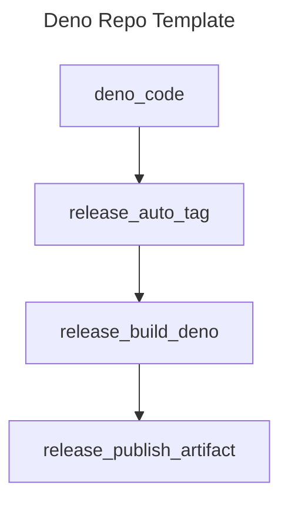

<!-- markdownlint-disable MD041 -->
<!-- markdownlint-disable MD012 -->

# Typescript Edge TEMPLATE

## Repository Template for Deno

### What is this?

> [!IMPORTANT]
>
> This is a microservice template for DENO

This project is a re-usable repository template for Typescript using Deno
deployment environment for edge-compiled applications. It is ideally suited for
Github actions and composite workflows because it compiles single-purpose binary
CLIs that are easily released with Brew using a Tap.

This makes distribution very simple, as any action can re-utilize the homebrew
tap to install the latest release from Github releases.

### Supported Platforms

- darwin
  - amd64
  - arm64
- linux
  - amd64
  - arm64
- windows
  - amd64
  - -arm64- (unsupported)

## Features

| Feature Name       | Purpose                                                                                             |
| ------------------ | --------------------------------------------------------------------------------------------------- |
| LeftHook           | Github pre-commit and push hooks, this is used in place of Husky because it is 12-factor compliant. |
| Make               | Type 'make' for a list of commands                                                                  |
| Makefile Tasks     | In place of a complete build system, we use a series of scripts listed in 'scripts' dir             |
| Deno Version 2.0.2 | See .dvmrc file                                                                                     |
| Source code        | `src/` directory contains built in auto-versioning                                                  |
| Release Notes      | release-notes.md file                                                                               |
| Trufflehog         | See .hogignore file for configuration                                                               |
| Prettier           | See .prettierignore for config                                                                      |
| Checkov            | Run `make setup-brew` and `make install-tools`                                                      |
| Installation       | Run `make install` to create baseline tags and versions and setup the repo for the first time       |
| Upgrade Templates  | Run `make upgrade` to refresh repository templates automatically                                    |

# Logical Diagram

<!-- github feature -->
<!-- markdownlint-disable MD046 -->

&nbsp;

# LICENSE

MIT License.  © Lynsei Asynynivynya 2025.
