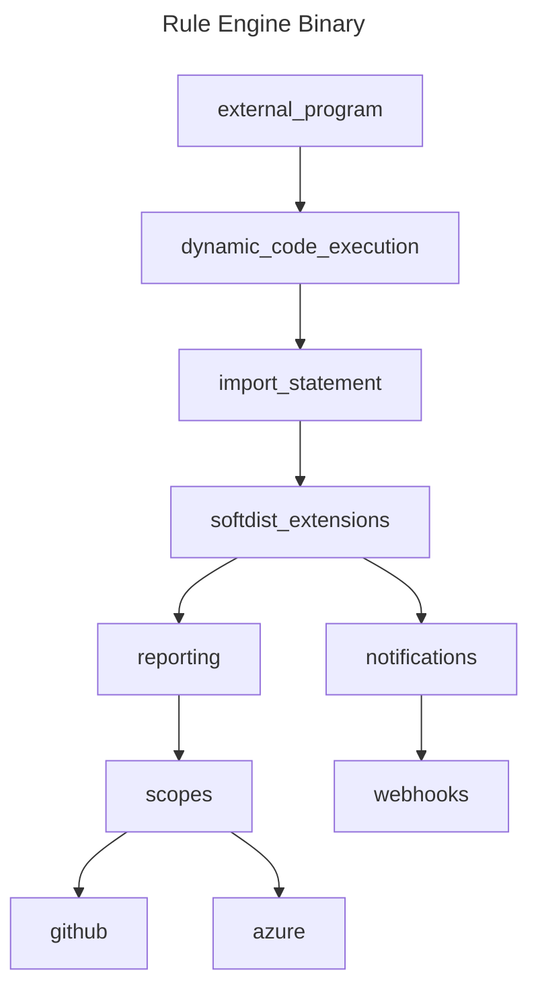

<!-- markdownlint-disable MD041 -->
<!-- markdownlint-disable MD012 -->

# Extensions

`@softdist/extensions` is a generic reporting toolkit that is packaged as a
[JSR](https://jsr.io/@softdist/extensions) module for use on any software that
requires reporting and inspection methods for Github scopes.

## Latest Updates

Please review the [release notes](https://github.com/pkgdist/extensions/blob/main/release-notes.md) for information on the latest release.

## What are Github Scopes?

We refer to Github Scopes frequently, and by scopes we mean the resources that
RBAC permissions apply to on Github. Examples include:

- Workflows
- Repository Settings
- Rulesets
- Actions
- Environments
- Organizations
- Gists

There are many more examples, but you can consider scopes to be basically any
major section of the Github API. We also will be using this software to work
with Azure scopes, so those interfaces will become available here in future
releases.

## Reporting methods

This repo houses extensions for external reporting functions that occur as async
calls through dynamic deno code evaluations.

The purpose is to abstract the reporting methods into a JSR package which can be
called using `deno run` by passing the `--import-map` flag and referencing a
JSON import map file containing this package.

> [!TIP]
>
> `--import-map` allows for any `deno run` commands to automatically include
> certain modules for use with `import` statements.

### What is this?

> [!IMPORTANT]
>
> This @softdist/extensions module is generic and opensource

This is a library for reporting and scoring tools. These tools can be used for
virtually any purpose as a standard reporting & notifications library. The
project goal is to provide a variety of reporting options which can be extended
easily for scoring, notifications, or to generate complex reports based on the
inspection of Github Scopes, Azure Scopes, and other objects.

## Repo Features

| Feature Name       | Purpose                                                                                   |
| :----------------- | :---------------------------------------------------------------------------------------- |
| `$report`          | Reporting function for scoring tabulation in streams, and notification functions in teams |
| `$const`           | Declared generic constants for local system paths and GITHUB API                          |
| `$compare`         | Comparison functions for deep YML objects.                                                |
| `$error`           | Generic error functions for including messages with specific colors                       |
| `$streams`         | Optic FileStream object for logging colored error messages to evaluated streams           |
| `$token`           | Token acquisition for GitHub CLI default, or .envcrypt files, or environment vars         |
| `$webhook`         | Webhook secret acquisition IFFE functions                                                 |
| `generatedVersion` | Software Version Information                                                              |
| `Type`             | Types used throughout this software                                                       |

## Logical Diagram

The following diagram explains the current logical flow of how to call and
utilize this package.

## About FileStream

> [!IMPORTANT]
> **Note:** This code relies on MIT licensed objects from `jsr:@onjara/optic`.

FileStreams 2.0.3 currently has a bug that disallows the use of FileStream
objects from import statements, as there is no `mod.ts` file
[here](https://github.com/onjara/optic/tree/master/streams/fileStream). Once
this bug is fixed we will remove the inclusion of optic code directly in our
package. (it's a stop gap measure)

&nbsp;

# LICENSE

This code uses the [MIT License](LICENSE) for OSS.

> © Lynsei Asynynivynya 2025.
